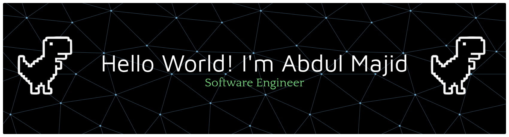

# Hello World! I'm Abdul Majid  👋

<!--  -->

## 🚀 About Me
<!-- ##  -->

A growth-oriented software engineer with a passion for continuous learning and innovation, specializing as a full-stack JavaScript developer. Experienced in IT support and Android development at a startup company, with a strong ability to manage independent projects and collaborate effectively within dynamic, high-performing teams.

<ul style="font-size:16px;">
    <li>🌱 I'm currently learning Next.js and improving my React skills.</li>
    <li>👩‍💻 I'm Currenly Learning Laravel Framework.</li>
    <li>📊 Building scalable frontend applications.</li>
    <li>🤖 I debug with console.log() and I'm proud of it!.</li>

</ul>

---

  

  

## 🛠️ Skills

### 💡 Programming Languages

  
  
    
    
  
  
  

### 🏠 Frontend Technologies

  
  
  
  
  
    
  
  
  
  
  
  
  
  
  
   
  
  
  
  
   

### 🚀 Styling & UI

  
  
  
  
  
  
  
  
  
  
  
  
  

### 💻 Backend & Database

  
  
  
  
  
  
  
  
  
  
  
  
  
  
  
  

    

### 📱 Testing

    
    
    

### 🔗 Tools & DevOps

  
  
  
  
  
  
  
  

### 🤖 Artificial Intelligence

    
    
    
    

---

<!-- ## 🎯 Featured Projects

### 💼 E-Commerce Dashboard

*Dynamic product filtering • Order tracking • Responsive design*

---

### 🌐 Portfolio SPA

*SEO Optimized • Dark Mode • High Performance*

---

### 📦 Warehouse Admin App

*Advanced Search • Pagination • Excel Export*

--- -->

## 📊 GitHub Analytics

  
  

<!-- 

  

 -->

  

---

<picture>
  <source media="(prefers-color-scheme: dark)" srcset="https://raw.githubusercontent.com/abdulmajid34/abdulmajid34/output/pacman-contribution-graph-dark.svg">
  <source media="(prefers-color-scheme: light)" srcset="https://raw.githubusercontent.com/abdulmajid34/abdulmajid34/output/pacman-contribution-graph.svg">
  
</picture>

  

---

## 📈 Activity Graph

  

---

## 🤝 Connect With Me

---

  

### 💡 "Code is like humor. When you have to explain it, it's bad." — Cory House

**⭐ From [abdulmajid34](https://github.com/abdulmajid34) with ❤️**

